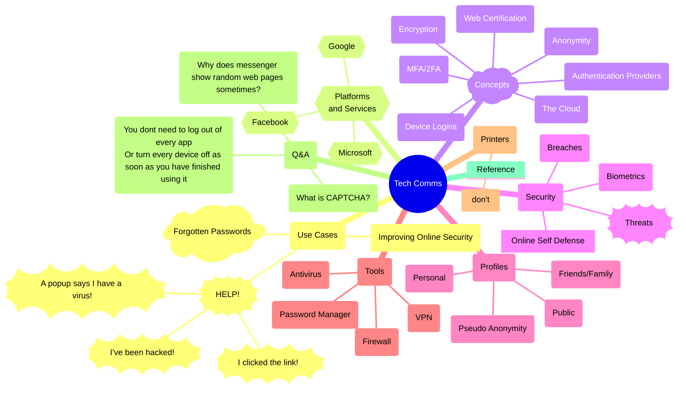

# Ideas

## Mind Map

### List
- Use Cases
  - HELP!
    - I Clicked the Link!
    - I've been hacked!
    - A popup says I have a virus!
  - Forgotten Passwords
  - Improving Online Security
- Platforms and Services
  - Microsoft
  - Google
  - Facebook
- Concepts
  - Web Certification
  - Authentication Providers
  - MFA/2FA
  - Device Logins
  - Anonymity
  - The Cloud
  - Encryption
- Security
  - Threats
  - Online Self Defense
  - Biometrics
  - Breaches
- Profiles
  - Public
  - Friends/Family
  - Personal
  - Pseudo Anonymity
- Tools
  - Antivirus
  - VPN
  - Password Manager
  - Firewall
- Printers
- Q&A
- Reference