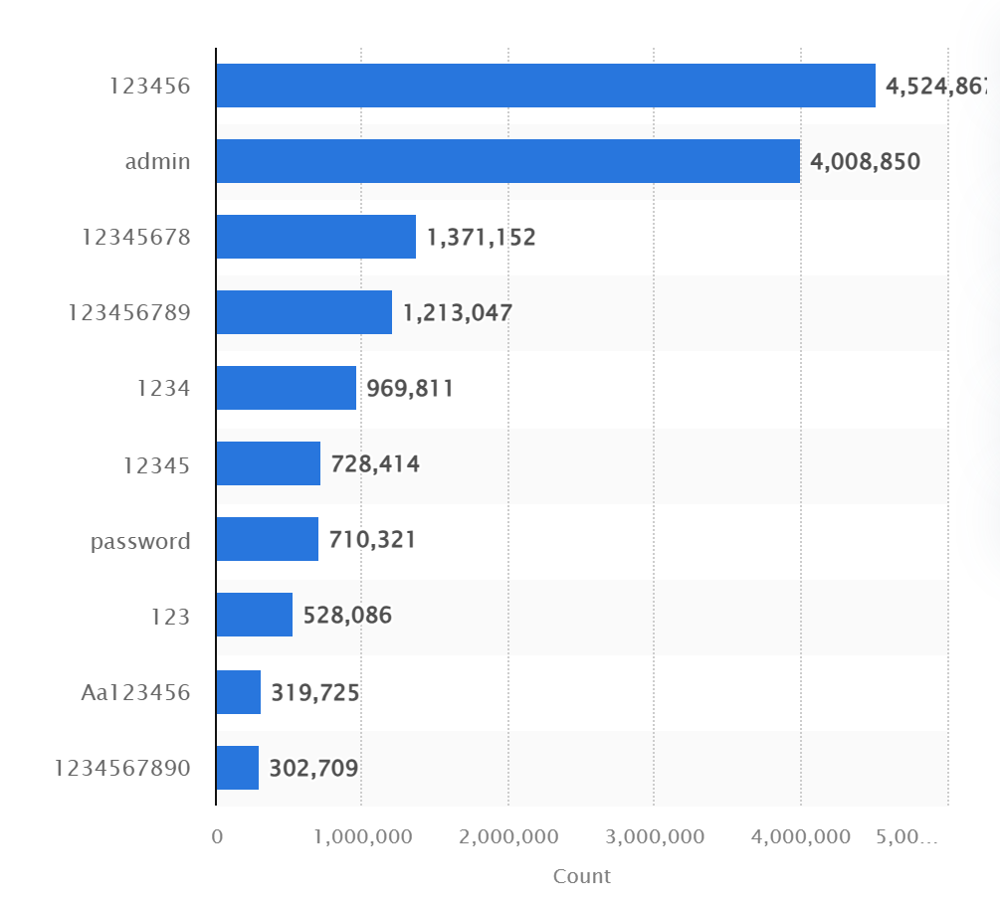

# Usernames & Passwords

## Overview

This old favourite has been around since the 1960's and it is still the method of choice for billions of people all over the world. Password security has come a long way in that time with new methods of password storage and validation, minimum length and complexity requirements and a plethora of material trying to educate users on how best to protect themselves using this resource.

## Usernames

When thinking of usernames, they can often be described as like the address to your house, in that it tells the system you are logging in to who you are. Usernames in particular attract favour because they allow a little bit of uniqueness to this digital representation of yourself. This too has been a popular feature since the old days of amateur radio (a.k.a. ham radio) in the early 20th century and the uk government even implemented a registration authority to ensure (among other things) that a user's bespoke chosen name (or 'handle') was unique to that user and was not allowed to be reused or impersonated.

### Popularity / What's in a name?

Usernames are typically 'public' information, though some systems these days can offer moderate privacy, allowing users to pick any name they like. Moreover, this too is an area where we often see 'soft' complexity requirements with things like years or special characters or other details suggested to your preferred username. There are two reasons for this

1. Some systems are so popular that in fact the overwhelming majority of usernames are already taken. Google is a good example of this and you can see this process in action when you are selecting a username when you create a new account.
2. Users tend to only pick from a limited vocabulary for their usernames and don't tend like to explore outside that. (It is also worth noting that the majority of 'users' who do are typically bots.) Moreover, when the system forces users to 'be creative', users also tend to be quite limited in their creative exploration and stick to a few variables like their date of birth or interests to embellish their username.

In addition, there has long been an association of usernames and pseudo-anonymity (also known by the portmanteau of pseudonymity). Many people enjoy a sense of building an alternative persona, but some people mistake this for anonymity or confuse it with 'freedom'.

In truth, there is freedom online, freedom to be yourself when you cannot in your physical life, freedom to make friends through shared interests and ideas rather than people physically close to you, freedom to learn, think, create and explore, freedom to better yourself and make the world a better place. But the 'freedom' that some people want, too often tends to be freedom from consequence when they behave badly, and most other people tend to take a dim view of bad behaviour, and these people tend to lose freedom over time.

### The roles it serves

For a long time, the main purpose a username served (aside from personalisation) was simply to be a unique identifier in a database somewhere. This had merits and drawbacks, it saved some space compared to more versatile systems, but typically it locked users into a single identity for the lifetime of their account. It turns out that users tend to like to change their username over time and may regret usernames they chose when they were younger. In fact this is so common there is something of a meme about it, often referred to it as some combination of "xXx_Vegeta_Pussy_Slayer_69_420_xXx" - I cringed just typing that.

Around the turn of the millennium, Microsoft brought an idea to the corporate market that cemented a change to how people were beginning to think about their username. They and other global business clients who were increasingly made up of an amalgamation of many other businesses had problems establishing widespread complex trust relationships between organisational domains that were impractical to fully integrate. You might have seen usernames like 'myorg\myusername' before where the first part represents the logon domain followed by your username. This works at the small to medium scale where you have a single business that expands to more territories or maybe buys one or two other small companies, but it doesnt scale as well at the global scale, particularly when you have multiple global companies that are all owned by the same entity. What these businesses needed was the ability to express multi-level domains as part of a single user identifier, which we already have. Your email address contains more information than you might realise, consider the following 'myusername@mydepartment.myorganisation.org.uk' - what information can we gather from that address?

 - Your organisation ('.myorganisation')
 - Your department ('@mydepartment')
 - Your region ('.uk')
 - And your username ('myusername')

With this information organisations can enable trust relationships (and thus logins) across many domains from many domains. This is mundane now but when I did my networking degree this was WILD!

This technology didn't remain in the business sector, it is still visible today when you login to your outlook with your hotmail address and indeed the idea was expanded upon with another technology [OAuth](oauth.md).

Some time around the late noughties, it became increasingly popular to make usernames changeable, this it turns out is a very easy change to implement provided you design your database inline with good practices. Quite simply, while the username still has to be unique, it should not be **the only** unique identifier for a user.

This change found its greatest demand from competitive gaming, where it is common for players who work together to display their team name (or clan) alongside their username (e.g. myuser_[myclan]). However, players over time may need to change clan and don't want to lose their hard earned statistics. Now, it's common to be able to change your username in many reputable services.

### Threats

Believe it or not there are in fact two principle threats that usernames can be part of and both of them relate to identity.

It is increasingly common in the age of the internet that people will foster multiple online profiles to represent different aspects of their life. For a long time this behaviour was the preserve of the powerful, the very wealthy, and celebrities, but the barriers to setting this up come down it makes a lot of sense for everyone to adopt this practice. It should be said that some platforms try to insist on one profile per user, such as facebook and there is a good reason for that - specifically that if people think that they are interacting in a way that cannot be attributed to their 'real' identity then they tend to behave poorly. We will return to this shortly.

However, even if a user does have multiple profiles they still have another much more difficult problem to deal with - search engine attribution. Modern search engines, or more specifically the data mining algorithms behind the scenes, have since the 90's been remarkably good at attributing links between two topics that a normal human would think are unrelated. For our purposes, I am referring to the fact that search engines (thanks to data mining) are able to discover and present to users details of other profiles that might be attributed to them when you search for a particular name. This can be difficult for online personalities for whom the revelation of their real identity or details such as where they live and who their family is can and have resulted in horrendous crimes perpetrated against them and their family members.

> There are many amusing anecdotes and urban legends surrounding data mining and the quirky relationships that it can uncover. My personal favourite is something of an urban legend that a project for a supermarket uncovered a relationship of men in their 20's and 30's buying beer and nappies on friday evenings after work. The tale goes that the store reasoned these men were being drawn in to buy nappies, but some of them went to the other end of the store to buy beer too. So the store created a display section for a popular brand of beer at the end of the nappies isle and beer sales supposedly went up tremendously.
> > I cant remember if that story was ever 100% verified, but regardless the impact data mining has on our everyday lives is no less real. From the moment to moment things you see on social media, the exact order retailers use to display their products, the precise message used in a political advertisement (tailored just for you personally with (literally) machine precision down to the exact second that you would scroll past it, and even if you scroll back up you might not see the same thing again), to the location (and price) of small coffee and food stalls. Tim Harford has an interesting book related to some of this subject called *'The Undercover Economist'*, where he delves into the hidden world of coffee carts.

Building on this, it should be noted that there are a number of organisations from whom it is very difficult to be anonymous and these don't tend to cross the minds of people who push the boundaries more than most, or who push very sensitive boundaries. There's a few levels of what I'm talking about here that im going to call legal authorities, implicit data holders, small data accessors.
Examples of these can include (but are not limited to):

Legal Authorities:

These may not actively collect all your information but they typically have the right to demand your information in certain conditions.

- Police
- Tax Authorities (H.M.R.C.)
- Courts
- Local Enforcement Agencies (e.g. for council tax, tv license fee)
- Financial Institutions
- National Security Authorities
- Legal organisations (Lawyers, solicitors)

Implicit Data Holders:

These are organisations who will come into posession of your personal data either by doing business with them, or in fact in most cases simply by having any interaction with them. Just searching for them is enough, you don't even have to visit the website because many of these organisations will trade agreements with each other for your data.

- Your Internet Service Provider
  - People often forget that your ISP can and do in most cases see and record everything you do online and will use / sell that information
- Data Brokers
- Google (Alphabet)
- Microsoft
- Apple
- Amazon
- Facebook (Meta)
- Retailers
- Advertising Agencies
- Social Media organisations
- Forums
- Communications Providers (E.G. email, messaging)
- Streaming media organisations
- Insurance underwriters
- Health monitoring service providers
- Quizzes, games and other apps you may encounter online or on your devices
- Data Dumps

Data Accessors:

These are people or entities who are able to access at least some of your data (legitimately or not or somewhere in between) and can therefore take steps to identify you

- Moderators of social media platforms and other social forums
- Open source intelligence groups / analysts
- CaaS organisations (Crime as a service)
  - Ransom organisations
  - Stolen identity traders
  - Harassment campaigns
  - Botnet organisations
  - Corporate espionage orgs
- Social Engineers
- Private investigative organisations
- Journalists
- Foreign nation state actors
  - Political influence operations

All of these people and organisations can or do have access to your data and particularly among some of these entities its not uncommon once you get on their radar for you to find that life can get a little harder in a variety of different ways whether its finding insurance at a reasonable price, or a forum moderator holding a grudge.

## Passwords

Moving on the password is still going strong despite being around for millennia - the earliest references to 'pass-words' is from Roman texts, but it is likely to have been around for longer. In a computing sense passwords have been around since the 1960's and the technology around passwords has really improved, requiring extensive and extremely complex mathematical calculations to validate.

### Drawbacks

The main drawbacks to usernames and passwords (mostly passwords) are the users. It turns out that humans are really bad at doing good passwords, and I include myself in that, we as a species are simply really, <u>**REALLY**</u> bad at it.

This primarily comes down to two things - easily guessable secrets and password reuse.

#### Easily Guessable

Many people are in habits of using things like maiden names, names of significant relationships (or crushes), pets names, children's names, place names, favourite media names (could be a favourite book or tv show, a favourite character or faction), all sorts of things that we will also proudly post, like, share and chat about online. Many people will attempt to add better security with the use of numbers and special characters either at the end or substituted for other characters, but I'm sad to say this technique probably hasn't been of much benefit since the 90's.

Even worse is when people use common passwords, simple passwords like 'Password1' or 'Aa123456' are some of the most common passwords used in 2023 according to statistics and business intelligence company [Statista](https://www.statista.com/statistics/1454162/most-used-passwords-worldwide/#:~:text=In%202023%2C%20the%20most%20common%20password%20worldwide%20was,used%20more%20than%20one%20million%20times%20in%202023.)

*Most commonly used passwords worldwide in 2023, copyright Statista, published February 2024, [source.](https://www.statista.com/statistics/1454162/most-used-passwords-worldwide/#:~:text=In%202023%2C%20the%20most%20common%20password%20worldwide%20was,used%20more%20than%20one%20million%20times%20in%202023.)

#### Reuse

What makes it worst of all is when people reuse passwords across multiple systems and platforms because they don't want to do the hard part of remembering lots of different passwords. When users do this it makes it even easier for criminals who may come into posession of your password for a different system to then try the same password on your more sensitive systems - and just like that, they're in.

Nobody wants to have to remember a different password for every system they have access to, I personally have roughly 300 different credentials and given that I struggle to remember shopping items unless theyre written down there is no way i can remember all those passwords. Fortunately for a long time now the concept of a password management system has existed and i have used something like in one form or another since the early noughties.

> in the early days it was a password protected word document, until I discovered the magic of Excel formulas and VBA macros. I still miss some functions i developed sometimes.

Nowadays there are much better products that can offer you much better protection and quality of life improvements like automatic login, phishing prevention, and access from multiple devices wherever you are in the world.

### Trusting the system

Most people think of passwords as being 'encrypted' and that is sort of true - there is historical merit to that and the contemporary secrecy technologies often have a foundation in encryption, but the reality of much more than that. Well written password systems use a special ***one-way only*** kind of encryption called '**hashing**' which requires the two computers to negotiate using an extremely complex mathematical formula with many hundreds of thousands of steps to achieve an outcome that can be verified.

Even though this is very complex, computers are still able to perform them very quickly, typically a fraction of a second. But despite this Passwords can still be broken using a variety of techniques, the two most common are

1. Dictionary attacks. This is where an attacker tries to use common passwords and variations of those to guess the users password. This can be made a lot easier by knowing things about your victim like the names of other family members, or pets, their date of birth, the data of birth of their children, favourite movies, music, etc.
2. Brute Force, a.k.a. Collisions. This technique has become less common in the last 10 years or so, or perhaps it is more accurate to say more niche. The basic premise is that a computer starts from a given point (for example the letter a) and keeps incrementing through letters (and cases), numbers and symbols and adding characters until it eventually finds the correct password. for example 'aa', 'ab', ... 'admin123'. It is very difficult, but there are a few things working in the attackers favour that make it not as difficult as you might think.
3. A combination of the above. Knowing something about the target user, their family, pets, likes, special memories, etc, an attacker can combine these two techniques to bring together the rigour of brute forcing and the speed of dictionary attacks.

> A 2019 estimate I found claimed that given the right kind of input conditions and using the appropriate kind of hardware it is reasonable to assume an attacker could make around 100 billion attempts per second to crack a basic windows password.
> However, the real difficulty of that depends on:
>
> - What information they have access to (there are key pieces they need)
> - What validation mechanism is available to them (they need to be able to validate locally)
> - The length of the password (longer is better)
> - The 'randomness' of the password (more random / less predictable is better)
> - The specific algorithm and length of the cypherkey (longer is better) used to secure the password

The gold standard for security algorithms and protocols is based on whats known as 'computational security', meaning that the sum of all computing power available to a reasonably expected threat-actor would take longer to break a secret than the possible useful lifetime of that secret.

## In summary

- Too many users are not sufficiently technically and security literate to understand the risks and benefits associated with different technologies and platforms.
  - There is insufficient education of what makes a 'good' password and technologies that can help users with their passwords.
  - Overwhelmingly the majority of users have insufficient knowledge or planning for what to do in the event of a breach, leaving them vulnerable to bad problems getting worse very quickly.
  - There is insufficient coverage (and presumably interest) in mainstream media outlets to publish and describe the breaches that happen in the real world and what they mean to users.
- Technology companies have in many cases been unsuccessful in encouraging many users to improve their technical literacy and adopt improved security practices and technologies.
  - Moreover, organisations who try restrict users from using less secure options or even try to implement improved security practices behind the scenes that users don't have to interact with directly will often face criticism and backlash. Microsoft, Google, and Apple have all faced this.
- Social engineers (and by darker extension con-men) have shown for decades (and millennia) that for the right person users are very easy to trick and they will reveal all sorts of information they shouldn't to people they shouldn't (i.e. passwords) and will willingly let attackers do bad things to them (even right in front of their victims) without the user comprehending what is happening to them until much later, sometimes if ever.
- Security researchers have been trying to warn of a problem since the turn of the millennium that its possible to see by looking at the discarded / published / leaked data from successive breaches that too many users (typically identifiable by email address or collections of other user details) use the same passwords across many systems.
  - Moreover its possible to see by looking at repeated breaches over time that for many users they will not change their password even after being told about the breach, or even where password change policies are in place, many will tend to just make the smallest possible change, such as capitalising one letter, or increment a number at the end of the password.
  - Building on this too many users will too often only do the barest minimum to meet length and complexity/randomness requirements of a password and if these are not present too many users will voluntarily make their passwords even less secure.
- Looking at the testimony of technical staff involved in ultimately criminal organisations or economies, technical forensics experts, reputable security organisations, and nation state security authorities, it is clear that the (largely hollywood oriented) conception that most people have of a 'hacker' couldn't be further from the depth and breadth of modern day technical criminal enterprise. Too many users are not only unaware of this but also unaware of the speed and scale of the problem when they have been breached.
