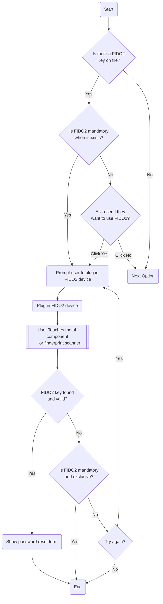

# Fast Identity Online (FIDO2)

Also known by some companies as Yubikey, or Google Titan. But these are mostly just branding for two popular implementations of the standard.

This is a process that I use in many places, including Google and I specifically use a number of Yubikey devices as part of this practice.

## Overview

This is generally considered the most secure option, but it has some drawbacks which mean it is not suitable for widespread adoption. However, this is commonly used in extremely high security scenarios where it is better that nobody has access to your account than the the wrong person. It is commonly used in governments, military / national security agencies, big technology companies, or by public figures, journalists, whistleblowers, dissidents, and many others including enthusiasts (nutters) like me. If lives could be at risk if someone breaks into your stuff, use this.

### Risks

The drawbacks however are that some organisations will configure their systems so that if a FIDO2 key exists then it is the only mecahnism that can unlock your account. Meaning, if you lose your keys, there is nothing anybody can do. Additionally these are physical devices which cost money and it is recommended you buy a minimum of two in case you lose one. After that its down to your operational security practices to ensure you dont lose access to one and nobody else can get access to your backup keys, and if somebody does get access to a key you need to remove its access as a priority.

## Process Flow

A breakdown of the FIDO2 process flow looks like this:

### Description

If the system has a FIDO2 key on file for you then it checks its setup to see if the FIDO2 key is mandatory to login. If so then it will prompt you to plug in the FIDO2 device, otherwise it will ask you if you want to use FIDO2 for authentication. Assuming you do, you plug in the device and typically either touch a small metal componend or put the appropriate finger on the fingerprint sensor. The system checks your fingerprint and looks for the appropriate key and if it is found the system will negotiate with the FIDO2 device to validate a secret known only to the system and the FIDO2 device. If this passes then everything is good, if not then you will probably get the option to try again with a backup device, but failing that there is nothing that can be done.
