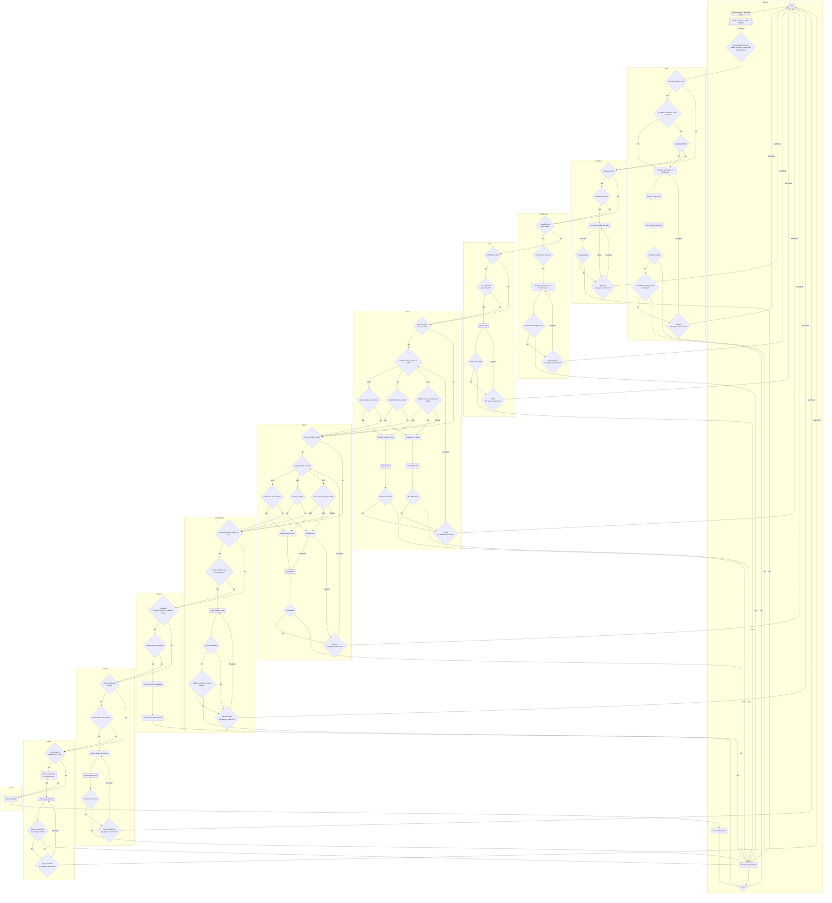

# Process Variations

## Flow Chart

The overall flow chart for the forgotten password process looks like this. This is very complicated but all of these options are used by platforms large and small. Different platforms will use different options, but generally it looks something like this.

Additionally, some processes are preferred over others, and I have broadly tried to follow recommendations for what is considered most secure to least. Some of these processes may be unfamiliar to you and i have tried to summarise these below. For more details there will be a separate guide coming out at some point in future.

## Further Details

Further Details for each section of the above can be found below.

1. [Yubikey / FIDO2](FIDO2.md)

