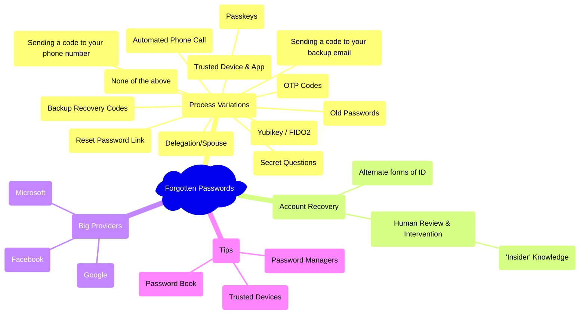

# Topics

## Mind Map

### List

- Process Variations
  - Reset Password Link
  - Secret Questions
  - Sending a code to your phone number
  - Automated Phone Call
  - Sending a code to your backup email
  - Delegation/Spouse
  - OTP Codes
  - Trusted Device & App
    - Passkeys
  - Backup Recovery Codes
  - Yubikey / FIDO2
  - Old Passwords
  - None of the above
- Account Recovery
  - Alternate forms of ID
  - Human Review & Intervention
    - 'Insider' Knowledge
- Big Providers
  - Google
  - Microsoft
  - Facebook
- Tips
  - Password Managers
  - Password Book
  - Trusted Devices

## Process Variations

Generally for big tech companies they support most of these options and there is something of a hierarchy for that recovery.

Would be useful to briefly summarise each and maybe link to external document for more info

thinking about how much detail i should go into, given some of these are unlikely to be used by the audience, but the technical part of me wants them to know about good practices and part of what i want to achieve is promoting good practices.

