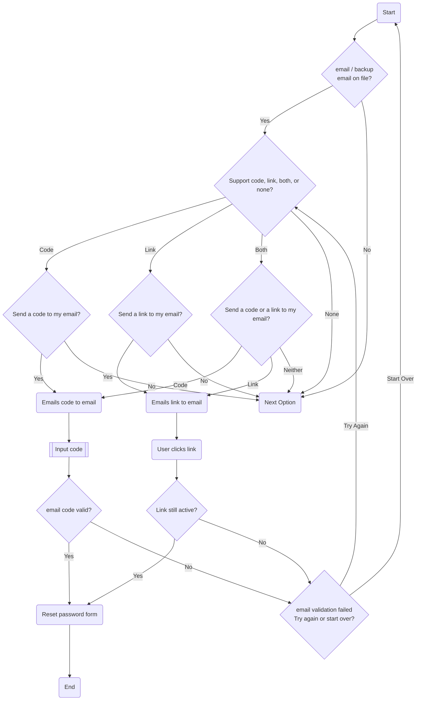

# Email

## Overview

Email password reset options should probably be best thought of as 'medium' security as whether they are indeed secure or not is dependant on how secure your other email addresses are. If for example you use the same or a similar password for everything then its reasonable to assume any other accounts you might hare are in the 'low to no security' bracket.

There are two common ways emails are used for validating a password reset, using a code or using a link.

### Using a Code

Using a code sent over email is really an extension of OTP authentication, but using a different process and typically the length of time you have to enter the code increases to somewhere between 5 minutes to an hour. The intent here is that a one time temporary code is emailed to a trusted email address, which you supply to the system you are attempting to login to, assuming you still have access to the address to which it was sent.

### Using a link

Using a reset link sent over email can be a quick and handy way to reset your password, assuming you still have access to the address to which the link was sent. If you do not, you may have just handed control over your account to somebody else. Much like the code options it is customary for the link to remain active for a period of time, typically somewhere between 5 minutes to 24 hours. Additionally it is also common for the link to only be usable once, so when you click on it you must follow through the process, because the link immediately expires.

## Process Flow

### Description

This process is a little more complex because emails are a little more versatile. But really what it says is if there is a email (or backup email) on file and the system supports using emails for validation then it makes a decision of what to offer the user based on what it supports. If it only supports one of either sending a code or sending a link then it give the use a choice of whether they want to use that method or not. If it supports both options the choice becomes which would the user prefer, or none at all. In the event that a user uses a code then they must input this code into the website, or in the event that the user uses a link they must click it. If the code is correct or the link still active then they are taken to the password reset page, but if not they are given the choice to try again or try something else.
