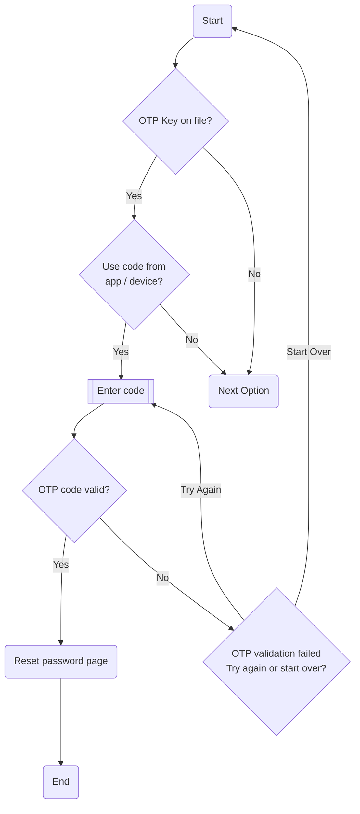

# One Time Password (OTP)

## Overview

When you enable 2FA on a website or application, you typically need to provide two pieces of information to log in: your regular password and a one-time password. The one-time password is generated by a special algorithm and is only valid for a short period of time, usually 30 seconds to a few minutes.

To generate the one-time password, you would typically use a mobile app, but some older implementations (like for financial services) might use a small physical device instead. Once you enter the one-time password along with your regular password, you can access your account. A couple of challenges with OTP are that for hardware generation the devices are easy to lose or break, and even with app generation it can be troublesome if you lose or break your phone.Moreover, because each password is only active for a very short amount of time (typically 30 seconds or 1 minute) it can be difficult for some users to get the process right within the short time allotted.

Despite those drawbacks it is considered a good and high security option and is used by many platforms and services.

## Process Flow

### Description

If an OTP key is linked with the account then the user is asked if they would like to use this authentication method. If they say yes they will be prompted to enter the currently displayed code from the app or device. If the code is valid and currently active they are presented with the password reset page, but if not they are prompted to try again or start over.
