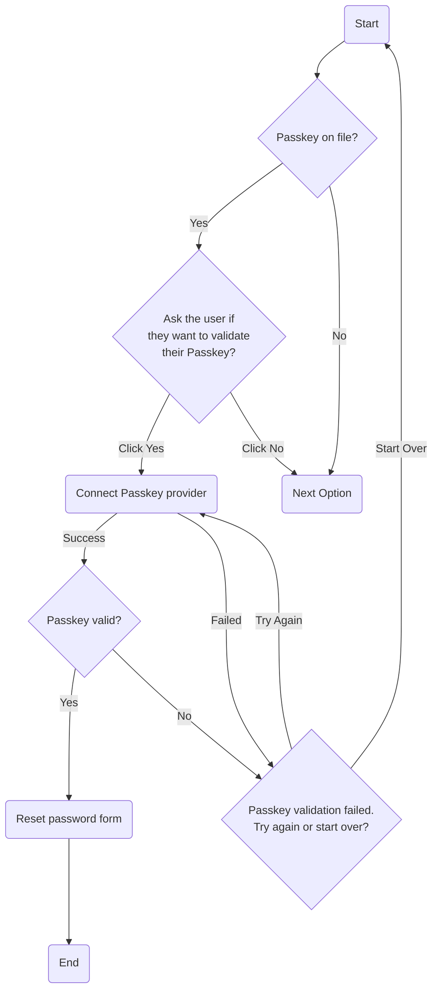

# Passkey

It's worth noting that the Passkey standard was generally intended as a replacement system to passwords, but a number of platforms have chosen to implement it as one option amongst many, including passwords.

## Overview
This is an increasingly popular option among the general public because it is intended to replace passwords and is generally more secure than passwords. However, it has a dependancy on a trusted device or application in order to handle negotiation of the secret.

## Process Flow

### Description

If a passkey is on file and the user agrees to use it for validation then the user is prompted to nominate where the passkey is. This is typically either on a device like your phone, or sometimes in the browser, or sometimes in your password manager. Once connected the remote system and your passkey negotiate to verify your identity and if successful you will be presented with the reset password page. However, if it fails to connect with your passkey provider, it cannot find the appropriate passkey, or the passkey is incorrect this process will fail.
