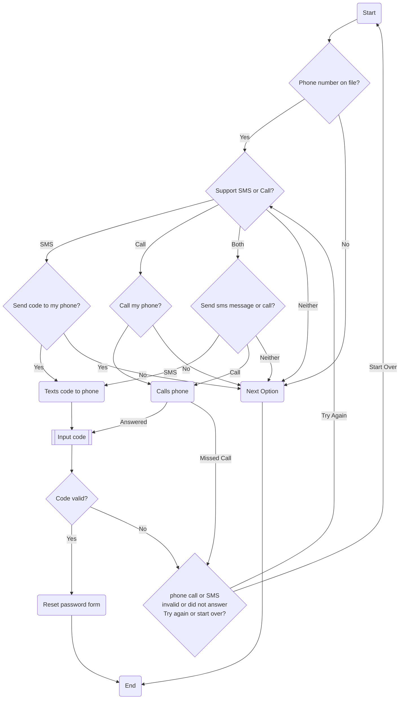

# Phone

## Overview

The option to use your phone is also an extension of the OTP mechanism. Users can receive a code either by SMS, some other messaging application (e.g. WhatsApp) or via an automated call. Much like with email users have an amount of time to submit that code into the prompt on a website for validation.

This is typically considered a medium security option (or in some countries low) because there are ways an attacker can clone or deny you access your phone number in favour of them. So when using this security model this is a risk to consider. Fortunately in many highly developed nations security around this type of attack has improved over the last 30 years and these days instances of this type of attack are uncommon, but they do still happen.

## Process Flow

### Description

In summary if we have a number on file and the system supports sending codes to phone numbers then it gives the user an option based on what it supports - SMS, Call, or either. If the user chooses one of these options then the code is sent to them and they must supply it to the system they are on. If the code is valid they can reset their password, if not, or if it has timed out, or they failed to answer the call, then they must try again.
