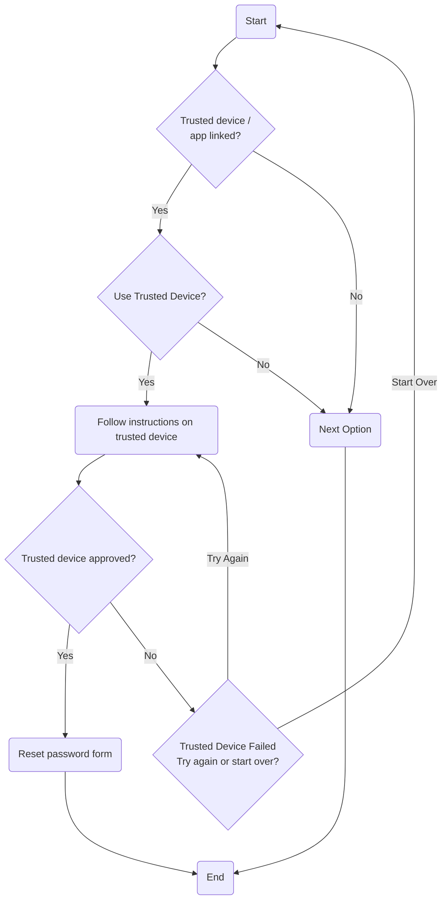

# Trusted Device

## Overview

A trusted device is typically a kind of passkey but bound to a bespoke application, typically with some additional rules about how the authentication process works. Google for example will display a popup on your phone with a prompt to approve or deny, while microsoft's app additionally makes you select the correct number displayed on the login screen.

## Process Flow

### Description

If a trusted device is linked with the account and the user has prompted that they wish to use the trusted device for verification then typically a popup will appear on the device with further instructions. Note the device must be switched on an have internet access for this to work. Once approved the appropriate password reset page is displayed, however if this fails the user will have to either try again or try another option.
